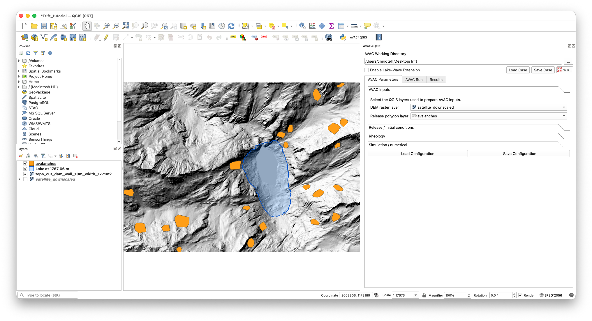
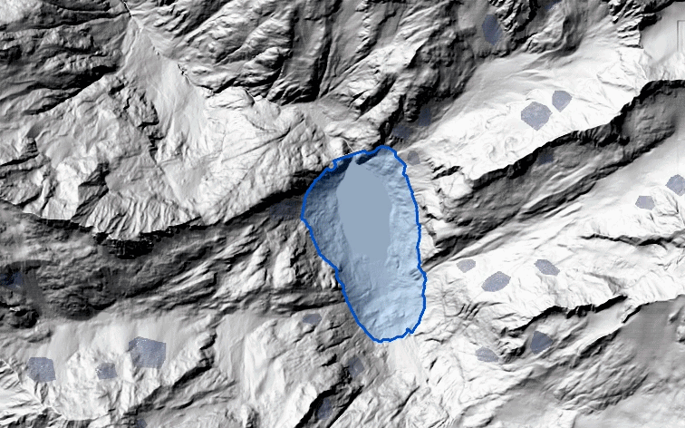

# AVAC4QGIS

AVAC4QGIS integrates avalanche simulation and optional avalanche-generated
lake-wave modeling into QGIS. The plugin provides case preparation, managed
solver execution, temporal visualization, profiles, gauges, and map export
without requiring users to configure Clawpack or a compiler.

The latest published release is **0.5.12** and targets **QGIS 3.44 LTS**.
This checkout contains the **6.0.0** source and reproducible validation suite.

## Interface overview

AVAC4QGIS runs as a dock inside the normal QGIS workspace, so simulation
inputs, derived layers, and results remain visible alongside the Browser and
Layers panels. The map below shows a hillshaded terrain with avalanche-release
polygons in orange and a derived lake polygon in translucent blue. The plugin
dock on the right groups the workflow into AVAC Parameters, AVAC Run, optional
WAVE pages, and a shared Results page.

## Installation

1. Download the installable package from the
   [AVAC4QGIS 0.5.12 release](https://github.com/cgotelli/AVAC-QGIS/releases/tag/v0.5.12).
   The macOS Apple Silicon package is
   [`avac_qgis-0.5.12-macos-arm64.zip`](https://github.com/cgotelli/AVAC-QGIS/releases/download/v0.5.12/avac_qgis-0.5.12-macos-arm64.zip).
   The 64-bit Windows package is
   [`avac_qgis-0.5.12-windows-amd64.zip`](https://github.com/cgotelli/AVAC-QGIS/releases/download/v0.5.12/avac_qgis-0.5.12-windows-amd64.zip).
2. In QGIS, open **Plugins → Manage and Install Plugins → Install from ZIP**.
3. Select the downloaded ZIP and open **AVAC4QGIS** from the Plugins menu.

Each release ZIP contains a managed solver runtime. Running the installed
plugin does not require GNU Make, a Fortran compiler, or a separate Clawpack
installation.

The GitHub source-code ZIP does **not** contain the managed solver runtimes and
is not an installable QGIS package. Use the release asset linked above when
installing AVAC4QGIS on another computer.

## Documentation

The [AVAC4QGIS User Interface Reference](docs/ui_reference/AVAC_QGIS_UI_REFERENCE.pdf)
explains the simulation workflow and every control in the graphical interface.
The same guide is available from the plugin's **Help** button.

The [AVAC4QGIS Tutorial](docs/tutorial/AVAC4QGIS_TUTORIAL.pdf) is a
figure-rich, step-by-step example from avalanche setup through optional
avalanche--lake coupling and result inspection.

## Basic workflow

An AVAC simulation needs two spatial inputs: a terrain DEM and one or more
avalanche-release polygons. Choose an **AVAC Working Directory**, select those
layers, configure the physical parameters, and prepare and run AVAC. The
working directory contains copied inputs, isolated runs, results, previews,
and exports; the managed runtime remains separate.

The repository's [`tutorial`](tutorial/) directory provides a 1 m terrain DEM
and release polygons for following the published tutorial. Its georeferenced
satellite image is an optional visual background and is not a solver input.

The optional **Enable Lake-Wave Extension** switch adds the WAVE parameter and
run pages. A WAVE scenario reads a completed AVAC result without modifying it
and transfers the avalanche contribution through the prepared internal
shoreline coupling. Before running AVAC, the lake polygon can be selected from
QGIS or derived directly from the terrain DEM by entering a water-surface
elevation and clicking a point inside the connected basin. AVAC and WAVE maps,
profiles, gauges, and time series are handled together in the final
**Results** page.

### Example coupled result

The animation below shows a small simulated avalanche entering a water body
and generating an impulse wave. It combines AVAC snow depth outside the lake
with WAVE water-surface displacement, which keeps the avalanche and water
contributions physically distinct in the final visualization.

## Validation notebooks

The [`validation`](validation/) directory contains the reproducible scientific
checks in three groups:

- [`AVAC`](validation/AVAC/) — water-limit and Coulomb analytical benchmarks;
- [`WAVE`](validation/WAVE/) — SWASHES water benchmarks, the Baines
  well-balanced test, the WRR sloping-bed case, and AMR/OpenMP reproducibility;
- [`ISeeSnow`](validation/ISeeSnow/) — the three official ISeeSnow avalanche
  intercomparison cases.

Every case has an independent Jupyter notebook. The notebooks install the
shared Python validation package into their active kernel, execute the current
source solver, calculate quantitative diagnostics, and recreate their
comparison figures. Generated solver output and figures are intentionally not
versioned.

Running validation from a clean checkout requires Python 3.10 or newer, Jupyter,
GNU Make, and `gfortran`. The SWASHES notebooks also require a C++ compiler.
The ISeeSnow notebooks download the pinned official 1.0 dataset on first use.

## Repository layout

- [`avac_qgis`](avac_qgis/) — QGIS plugin source;
- [`avac-main/src/AVAC`](avac-main/src/AVAC/) — AVAC solver source;
- [`avac-main/src/WAVE`](avac-main/src/WAVE/) — WAVE solver source;
- [`avac-main/clawpack-v5.14.0`](avac-main/clawpack-v5.14.0/) — pinned shared
  Clawpack source;
- [`validation`](validation/) — executable notebooks, drivers, analytical
  routines, and validation support package;
- [`docs`](docs/) — published user documentation;
- [`tools`](tools/) — runtime and plugin package builders.

Compiled executables, managed runtime archives, installable release ZIPs, and
generated validation products are excluded from source control.

## Third-party software

See [THIRD_PARTY_NOTICES.md](THIRD_PARTY_NOTICES.md) for the included solver and
analytical-reference dependencies and their retained license notices.
