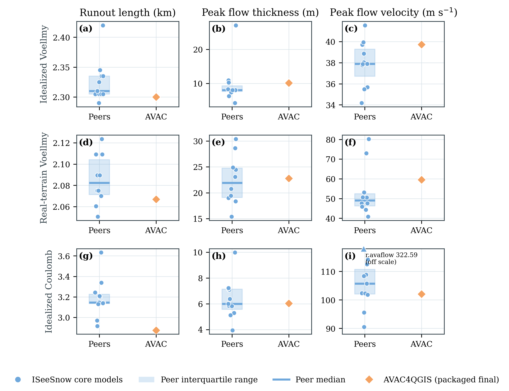

# ISeeSnow comparison: packaged baseline

This baseline was reproduced on Windows on 2026-09-05 with source revision
`76844b969a644df2338ed0e26544a413fcc2f9a6` and AVAC4QGIS 0.6.1. All three
simulations completed 1200 s with 121 outputs at 10 s intervals, using one
worker, a 5 m grid, and the second-order solver. No accepted step exceeded
the configured CFL maximum of 1.0, and no rejected CFL trials were needed.

## Figure and caption



**Suggested caption.** AVAC4QGIS results for the ISeeSnow 1.0 idealized Voellmy,
real-terrain Voellmy, and idealized Coulomb cases (rows). Columns show runout
along the prescribed thalweg where peak flow thickness (PFT) exceeds 0.5 m,
maximum PFT normal to terrain, and maximum terrain-tangent peak flow velocity
(PFV). Blue points are the Table C1 core models (11, 10, and 11 models by row);
blue shading and horizontal lines denote their interquartile ranges and
medians. Orange diamonds show the reproduced packaged AVAC results. The
Coulomb r.avaflow PFV value of 322.59 m/s is displayed by an off-scale marker
and retained in all peer statistics. Coulomb uses Minmod, target CFL 0.25,
and a 0.05 m shallow-state regularization depth; the two Voellmy cases use
van Leer, target CFL 0.5, and a separate 0.10 m state depth. Physical benchmark
parameters are unchanged. PFT is the primary selection criterion, with PFV
retained as a secondary audit. The Coulomb numerical scheme was selected
using the same peer fields subsequently scored, so its agreement is
in-sample evidence.

The separate spatial comparisons use only exactly aligned submitted peer
rasters: 8, 7, and 7 models, respectively. Those populations differ from the
Table C1 scalar populations. Eleven raster submissions were excluded for
grid-size or cell-centre mismatches; no submitted raster was shifted,
resampled, clipped, or normalized for numerical comparison.

## Baseline results

| Case | Limiter | Target / maximum observed CFL | PFT peak (m) | Core peer PFT median (m) | Runout (km) | Core peer runout median (km) | Relative volume change | Practical rest confirmed (s) |
|---|---|---|---:|---:|---:|---:|---:|---:|
| IdealizedTopo | van Leer | 0.5 / 0.63 | 10.0959645 | 8.037 | 2.3000516 | 2.310 | -1.0993058e-9 | not reached |
| RealTopo | van Leer | 0.5 / 0.59 | 22.7901766 | 21.925 | 2.0670047 | 2.082305 | 9.1439583e-11 | not reached |
| CoulombOnly | Minmod | 0.25 / 0.29 | 6.0286141 | 5.990 | 2.8749987 | 3.144300 | -4.6136262e-10 | 560 |

Coulomb practical rest is sustained from 540 s and confirmed at 560 s with
no later rebound through 1200 s. The definition requires moving volume above
the 0.05 m depth threshold to remain at or below 1% of the initial volume for
three consecutive outputs and all later outputs. It does not require every
shallow cell to have zero velocity. The two Voellmy cases remain active at the
ceiling. Relative volume changes are fractions, not percentages.

Coulomb's PFT peak is near the core peer median, but runout is 8.565% shorter
than that median and its area with PFT above 0.01 m is 348950 m2, 9.098% below
the smallest aligned peer area (383875 m2). These residual spatial differences
must accompany any claim of agreement based on the peak alone.

## Provenance and reproduction

The accompanying [figure provenance](figures/iseesnow_intercomparison.json)
records the validated submission, inputs, thalwegs, peer table, solver, and
runtime artifacts. The [PDF](figures/iseesnow_intercomparison.pdf) is the
vector export. The [case setup figure](figures/iseesnow_case_setup.png) shows
the terrain and release areas.

- Windows plugin ZIP SHA-256: `a872f191e645d65ffbf859eead7d161517351937286f38777c0283d66b80ce78`.
- Canonical runtime manifest SHA-256: `e49b9da9b04e507f0660a0b66b4429ed83a63ed9b9e87b1e70784327b9b0e01b`.
- Solver SHA-256: `0b0ebc8539c71daf358617747ad728a013cd4d0ad4e5951331011b3484501e23`.
- AVAC setrun SHA-256: `37b8107b81e2a8f18db885f7090146e18f62fc4e67dd7dbc9b0a1eafb646e970`.
- Peer table SHA-256: `d8b9a9f16b760b1702962380997e26e1910467fd07a73c3563c6b34b430e9094`.

The external evidence directory is
`AVAC-QGIS-validation-runs/iseesnow-investigation/publication-final-1200s-76844b9`
beside the repository; the comparison directory has the suffix `-comparison`.
Each case retains its summary, submission fields, solver log, and native mass
history. The runner removed transient native frames after their diagnostics
were extracted. Their reproduction requires rerunning the solver.

To reproduce the figure from that completed result root:

```powershell
python validation/ISeeSnow/paper_figures/make_iseesnow_figures.py `
  --results-root <completed-results-root> `
  --avac-label "AVAC4QGIS (packaged final)" `
  --expected-runtime-manifest-sha256 e49b9da9b04e507f0660a0b66b4429ed83a63ed9b9e87b1e70784327b9b0e01b
python validation/ISeeSnow/compare_iseesnow.py --case all `
  --results-root <completed-results-root> --output-root <comparison-output-root>
```

On Windows the driver falls back to wall time for its table's CPU field;
performance comparisons should use the explicitly labelled solver-log CPU
or measured wall time instead.
