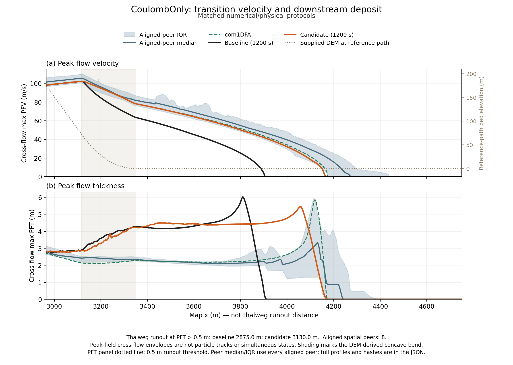
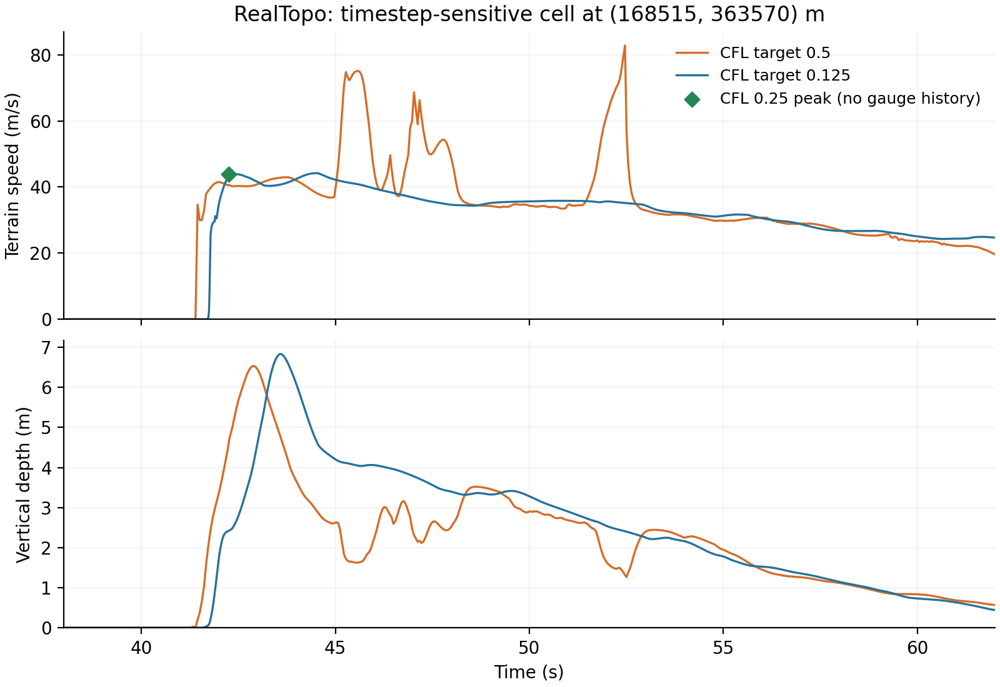

# ISeeSnow comparison: curved-terrain momentum correction

The missing Coulomb runout was principally a changing-terrain momentum error,
not a reason to reduce physical curvature friction. The production source now
transports velocity between reconstructed terrain tangent planes. The same
correction is included in the tested Windows plugin runtime, with no fitted
friction, release, limiter, depth threshold or benchmark-specific switch.
See the [derivation and limitations](../../validation/ISeeSnow/COULOMB_RUNOUT_TRANSPORT.md).

The reproduced baseline is source `76844b9`, preserved in commit `ee0d98e`.
The corrected production source is committed through `9b29363`; comparison
tools are committed through `ed43fb5`. Both suites completed 1200 s on Windows
on 2026-09-05: 121 outputs at 10 s intervals, one worker, 5 m grid, order two,
and matched physical/numerical controls. No accepted-CFL violations or rejected
CFL trials occurred in any of the six full-suite runs. Nothing was pushed.

## Article figure and caption


**Suggested caption.** AVAC4QGIS comparison with the ISeeSnow 1.0 idealized
Voellmy, real-terrain Voellmy and idealized Coulomb benchmarks (rows). Columns
show thalweg runout at peak flow thickness (PFT) above 0.5 m, maximum
terrain-normal PFT and maximum terrain-tangent peak flow velocity (PFV).
Blue points, shading and horizontal lines denote Table C1 core models,
interquartile ranges and medians (11, 10 and 11 models). Green circles are the
previous packaged code; orange diamonds include terrain-tangent momentum
transport. Coulomb r.avaflow PFV (322.59 m/s) is shown off scale but retained in
all statistics. Both versions use Minmod, target CFL 0.25 and regularization
depth 0.05 m for Coulomb; van Leer, target CFL 0.5 and separate depth 0.10 m for
Voellmy. Basal curvature normal-load friction is unchanged. PFT field agreement
is primary; PFV is a secondary audit. The RealTopo current PFV maximum is
timestep-sensitive and is not a converged velocity prediction.

[Vector PDF](figures/iseesnow_intercomparison.pdf) and
[figure provenance](figures/iseesnow_intercomparison.json).
The [case setup figure](figures/iseesnow_case_setup.png) remains applicable:
the terrain and release geometry did not change.

## Matched full-duration results

| Case | Runout before / after (m) | Core peer median (m) | PFT field score before / after | PFT improvement | Per-peer PFT errors improved |
| --- | ---: | ---: | ---: | ---: | ---: |
| IdealizedTopo | 2300.052 / 2310.051 | 2310.000 | 1.077691 / 0.967689 | 10.21% | 9/9 |
| RealTopo | 2067.005 / 2093.315 | 2082.305 | 1.098223 / 0.966457 | 12.00% | 5/8 |
| CoulombOnly | 2874.999 / 3130.041 | 3144.300 | 1.200518 / 0.991161 | 17.44% | 7/8 |

The PFT score is the median of full-grid candidate-to-peer RMSE divided by
each peer's median RMSE to the other peers; lower is better. Both versions
use the same exactly aligned spatial population: 9/8/8 models, now including
previously omitted native MoT-Voellmy h_max/s_max files. No submitted raster
is shifted or resampled. These populations differ from Table C1's 11/10/11
scalar populations; the spatial Voellmy populations include FLO-2D. Earlier
seven-peer limiter scores are not directly comparable. The prior limiter
selection used the peer fields subsequently scored; this is in-sample evidence,
not independent validation or a repeat of the limiter selection.

| Case | PFT peak before / after (m) | PFV peak before / after (m/s) | PFV field score before / after | Current relative volume change | Practical rest confirmed before / after (s) |
| --- | ---: | ---: | ---: | ---: | ---: |
| IdealizedTopo | 10.095965 / 9.606865 | 39.720840 / 39.722583 | 0.950307 / 0.950043 | +7.9951e-10 | not reached / not reached |
| RealTopo | 22.790177 / 21.066361 | 59.533824 / 82.794039 | 1.126264 / 0.956529 | -6.5024e-11 | not reached / not reached |
| CoulombOnly | 6.028614 / 5.441116 | 102.041830 / 102.126150 | 1.037631 / 0.980957 | +1.0095e-9 | 560 / 640 |

PFV field scores use the analogous velocity-field peer normalization,
independently of PFT. Aggregate PFV agreement is essentially unchanged for
IdealizedTopo and improves for RealTopo and Coulomb. This does not mean every
peer or local velocity improves: PFV paired wins are 8/9, 5/8 and 7/8. RealTopo
PFT/PFV agreement worsens against FLO-2D, Gerris and minVoellmy; the Gerris PFV
RMSE increase is only 0.000122 m/s. Coulomb's exception is TITAN.
Full per-peer evidence is retained in the
[field comparison JSON](figures/iseesnow_terrain_transport_field_comparison.json)
and [secondary-score audit](figures/iseesnow_terrain_transport_peer_scores.json).

Coulomb now lies 14.26 m (0.454%) below the core peer runout median, versus
269.30 m (8.565%) before. Its PFT support above 0.01 m grows from 348950 to
396375 m2. However, its maximum PFT moves farther from the scalar median
(5.990 m): the new 5.441 m is slightly below the core interquartile range
(5.555 to 7.125 m). Better spatial agreement is not a claim that every scalar
improved. IdealizedTopo's maximum PFT remains above its peer upper quartile.

Coulomb practical rest is sustained from 620 s and confirmed at 640 s, with
no later rebound through 1200 s. This requires moving volume above vertical
depth 0.05 m to stay below 1% of initial volume for three consecutive outputs
and all later outputs; it does not require all shallow velocities to vanish.
The two Voellmy cases remain active at the ceiling in both versions. Volume
changes above are fractions, not percentages. Maximum observed CFL values in
the corrected suite are 0.63, 0.81 and 0.29, below the acceptance ceiling 1.0.

## Why the Coulomb deposit moves downstream



The incoming straight-slope peak speed already matched com1DFA closely.
The deficit developed as terrain flattened. At map x=3200, 3300 and 3400 m,
baseline PFV was 84.300, 69.438 and 60.224 m/s; corrected PFV is 94.686,
83.826 and 75.523 m/s; com1DFA gives 94.963, 84.036 and 75.867 m/s.
The old missing stopping distance at x=3400, using unchanged Coulomb
coefficient 0.4, is about 271 m. The correction restores the transition
velocity without suppressing physical curvature friction.

The curves are peak-field cross-flow envelopes, not simultaneous states or
particle trajectories. Map x is not the thalweg runout coordinate. Both AVAC
profiles use the same 1200 s protocol; the shaded bend is derived from the DEM.
Peer median/IQR include all eight aligned spatial submissions, with com1DFA
shown separately. A remaining discrepancy is visible in the downstream PFT
plateau: about 4.48 m versus peer median 2.22 m at x=3500, and 4.38 versus
2.11 m at x=3700. Runout recovery does not resolve every deposit-shape error.

[Profile PDF](figures/coulomb_runout_diagnosis.pdf) and
[profiles, hashes and protocol checks](figures/coulomb_runout_diagnosis.json).

## Verification and remaining release limitations

Kerswell Coulomb AMR (10 s) and the separate uniform WRR water control (5 s)
are byte-identical to baseline in every saved native/fixed-grid field. The
uniform Coulomb slope control (6 s) has unchanged analytical front/rear errors;
depth and raw velocity differ by at most 1.86e-10 m and 2.72e-7 m/s. These
are non-regression results, not improved coarse-grid accuracy. The historical
constant-slope and WRR publication AMR runs still stop early; they must not be
reported as completed verification passes. Curved multilevel AMR is not
certified by the present single-level ISeeSnow suite.



The RealTopo peak at default CFL 0.5 contains pulses absent at 0.25 and 0.125.
At the original hotspot the maxima are 82.794, 43.913 and 44.196 m/s. The
coarse peak has simultaneous vertical depth 1.317 m and positive contact load,
so it is not simply a dry-cell value. The global smaller-timestep maxima
occur elsewhere (69.786 and 71.775 m/s), with sensitive timing. The green
marker is the actual CFL-0.25 peak, not an invented gauge history.

The 120 s timestep audit shows successive full-field differences contracting:
PFT RMSE 0.07650 to 0.03666 m, PFV RMSE 0.60959 to 0.29413 m/s. PFT peer scores
vary by less than 0.9%, without monotonic improvement at smaller CFL. For
Coulomb, halving CFL from 0.25 to 0.125 changes runout by one cell but worsens
PFT agreement against all eight peers. Defaults were held fixed for the matched
source comparison; release remains on hold pending temporal analysis. These
short sensitivity scores are not substituted for the full-duration table.
[Gauge/field audit data](figures/realtopo_timestep_sensitivity.json).

The new finite rotation preserves energy between reconstructed tangent planes,
not full PDE energy. The first-order geometric backtrace and pre-existing
per-step shallow momentum projection require further source/flux/timestep
analysis. The latter is timestep- and AMR-subcycling-sensitive. A smaller
accepted CFL guarantees neither convergence nor improved peer agreement.

**Assessment:** retain the justified, general geometric correction and its
better runout/PFT results, but hold the push/release recommendation until the
RealTopo velocity pulses and publication-AMR early stops are addressed.
The next numerical study should isolate source splitting and make shallow-state
regularization timestep-consistent, then repeat curved and flat regressions
without fitting friction or changing benchmark inputs.

## Windows package, provenance and reproduction

The exact corrected executable was packaged without recompilation and tested
through the normal QGIS dock in a fresh isolated profile. AVAC/WAVE runtimes
and managed Clawpack installed automatically; the solver exited 0 and wrote
all four native plus four fixed-grid smoke-test outputs. No dependency was
installed manually. Offscreen QGIS still crashes during application teardown
after functional success; the same harness reproduces this with the previous
package. Functional success is not a claim of clean application shutdown.

- Plugin ZIP SHA-256: `51eb9ebace8f79ddbd65829ae6a6fd3a712eebab32b45cebabd93565854798dd`.
- Canonical runtime manifest SHA-256: `fbaa98125cbe67000ed9f4cc5e412625c6a8d04c659a19e6492fcade5146ccb3`.
- AVAC solver SHA-256: `0765453579d6fa0d90a6e6cb7a8bfee77543d8cf6aec372c459bf72edbb46b88`.
- AVAC setrun SHA-256: `37b8107b81e2a8f18db885f7090146e18f62fc4e67dd7dbc9b0a1eafb646e970`.
- Peer table SHA-256: `d8b9a9f16b760b1702962380997e26e1910467fd07a73c3563c6b34b430e9094`.

Both packages' complete article protocols, runtime manifests and submission
fields were independently checked. The cross-source JSON additionally checks
the same official inputs, physical controls, generated release fields and
aligned peer population. The figure's optional prior overlay is backed by
that independently authenticated comparison, not an assumption about a folder.

External evidence beside the repository is retained under
`AVAC-QGIS-validation-runs/iseesnow-investigation/`:

- Baseline: `publication-final-1200s-76844b9`.
- Corrected: `pt-07654535-t1200`, including all native frames and summaries.
- Matched comparison: `pt-07654535-t1200-comparison`.
- Flat/peer audits: `runout-investigation-76844b9`.
- Three-timestep velocity audit: `runout-physics-audit`.

The package is in `AVAC-QGIS-validation-runs/windows-release-0.6.1-terrain-0765`;
automatic installation evidence is in `AVAC-QGIS-validation-runs/qgis-terrain-0765`.
The baseline driver removed transient native frames after diagnostics; those
require rerunning the baseline. Corrected raw frames are retained. Recorded
wall times are not controlled performance benchmarks: concurrent jobs differed.

```text
python validation/ISeeSnow/compare_source_runs.py --baseline BASELINE_RESULTS --candidate CORRECTED_RESULTS --output COMPARISON_OUTPUT
python validation/ISeeSnow/paper_figures/make_iseesnow_figures.py --results-root CORRECTED_RESULTS --comparison-root BASELINE_RESULTS --avac-label "AVAC4QGIS (terrain transport)" --comparison-label "Previous packaged code" --expected-runtime-manifest-sha256 fbaa98125cbe67000ed9f4cc5e412625c6a8d04c659a19e6492fcade5146ccb3
python validation/ISeeSnow/paper_figures/make_coulomb_runout_diagnosis.py --baseline BASELINE_RESULTS --candidate CORRECTED_RESULTS --output docs/article/figures
```
